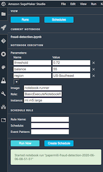
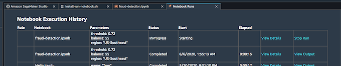

# Quick Start

> __TL;DR__ To be really quick, go straight to the instructions at [Setting up your environment](#setting-up-your-environment).

This document shows how to install and run the `sagemaker-run-notebooks` library that lets you run and schedule Jupyter notebook executions as SageMaker Processing Jobs.

This library provides three interfaces to the notebook execution functionality:

1. A command line interface (CLI)
2. A Python library
3. A JupyterLab extension that can be enabled for JupyterLab running locally, in SageMaker Studio, or on a SageMaker notebook instance

Each of the interfaces has the same functionality, so which to use is a matter of preference. You can use them in combination if you choose. For example, you can launch a notebook execution from the CLI, but monitor and view the output using the JupyterLab extension.

We use the open source tool [Papermill][papermill] to execute the notebooks. Papermill has many features, but one of the most interesting is that you can add parameters to your notebook runs. To do this, you set a tag on a single cell in your notebook that marks it as the "parameter cell". Papermill will insert a cell directly after that at runtime with the parameter values you set when starting the job. You can see details in the Papermill docs [here][papermill-parameters].

More detailed documentation, including full API documentation for the library and all the options for the
can be downloaded as HTML files from the [latest GitHub release][release]. Download `docs.tar.gz` and untar it with `tar xzf docs.tar.gz`. Then open the file `sagemaker-run-notebook-docs/index.html` in your browser
to view the documentation.

[papermill]: https://github.com/nteract/papermill
[papermill-parameters]: https://papermill.readthedocs.io/en/latest/usage-parameterize.html

Start by setting up your environment and then look at the instructions for the interface you want to use.

Contents:

- [Quick Start](#quick-start)
  - [Setting up your environment](#setting-up-your-environment)
      - [1. Install the library](#1-install-the-library)
      - [2. Create roles, policies and the Lambda function](#2-create-roles-policies-and-the-lambda-function)
      - [3. Create a Docker container to run the notebook](#3-create-a-docker-container-to-run-the-notebook)
  - [Use the command-line tool to execute and schedule notebooks](#use-the-command-line-tool-to-execute-and-schedule-notebooks)
      - [Run a notebook on demand](#run-a-notebook-on-demand)
      - [Run a notebook on a schedule](#run-a-notebook-on-a-schedule)
      - [See the jobs that have run and retrieve output](#see-the-jobs-that-have-run-and-retrieve-output)
  - [Using the Python library](#using-the-python-library)
  - [Activating the JupyterLab extension](#activating-the-jupyterlab-extension)
      - [In a SageMaker Notebook instance](#in-a-sagemaker-notebook-instance)
      - [In SageMaker Studio](#in-sagemaker-studio)
      - [On a laptop or other system](#on-a-laptop-or-other-system)
  - [Using the JupyterLab extension](#using-the-jupyterlab-extension)

The files we reference here can be downloaded from the [latest GitHub release][release].

If you want to schedule notebooks without using the library, there are resources included in the
release to help you do that. See the [DIY instructions][DIY] on GitHub for details.

[release]: https://github.com/aws-samples/sagemaker-run-notebook/releases/latest
[DIY]: https://github.com/aws-samples/sagemaker-run-notebook/blob/master/DIY.md

## Setting up your environment

To follow this recipe, you'll need to have AWS credentials set up that give you full permission on CloudFormation. You'll add more permissions with the installed policy later in the recipe.

#### 1. Install the library

You can install the library directly from the GitHub release using pip:

```sh
$ pip install https://github.com/aws-samples/sagemaker-run-notebook/releases/download/v0.18.0/sagemaker_run_notebook-0.18.0.tar.gz
```

This installs the sagemaker-run-notebook library and CLI tool. It also installs the JupyterLab plug-in but does not activate it. See below in [Activating the JupyterLab Extension](#activating-the-jupyterlab-extension) for more information.

#### 2. Create roles, policies and the Lambda function

```sh
$ run-notebook create-infrastructure
```

One of the policies created here is `ExecuteNotebookClientPolicy-us-east-1` (replace `us-east-1` with the name of the region you're running in). If you're not running with administrative permissions, you should add that policy to the user or role that you're using to invoke and schedule notebooks.

For complete information on the roles and policies, see the [`cloudformation-base.yml` on GitHub][cfn-template].
The source code for the Lambda function is at [`lambda-function.py` on GitHub][lambda-function].

[cfn-template]: https://github.com/aws-samples/sagemaker-run-notebook/blob/master/sagemaker_run_notebook/cloudformation-base.yml
[lambda-function]: https://github.com/aws-samples/sagemaker-run-notebook/blob/master/sagemaker_run_notebook/lambda_function.py

#### 3. Create a Docker container to run the notebook

Jobs run in SageMaker Processing Jobs run inside a Docker container. For this project, we have defined
the container to include a script to set up the environment and run Papermill on the
input notebook.

```sh
$ run-notebook create-container
```

This creates a temporary project in AWS CodeBuild to build your Docker container image so there's no need
to install Docker locally.

_Optional_: If you want to add custom dependencies to your container, you can create a requirements.txt file as
described at [Requirements Files][requirements] in the `pip` documentation. Then add that to your CLI command
like this:

```sh
$ run-notebook create-container --requirements requirements.txt
```

More customization is possible. Run `run-notebook create-container --help` or see the docs for more information.

If you'd rather do the Docker build on your local system, you can use the DIY recipe specified in [Create a container image to run your notebook][DIY-container].

[requirements]: https://pip.pypa.io/en/stable/user_guide/#requirements-files
[DIY-container]: https://github.com/aws-samples/sagemaker-run-notebook/blob/master/DIY.md#2-create-a-container-image-to-run-your-notebook
## Use the command-line tool to execute and schedule notebooks

To get information on how to use the CLI, run `run-notebook --help` or view the help documentation described above.

#### Run a notebook on demand

To run a notebook:

```sh
$ run-notebook run mynotebook.ipynb -p p=0.5 -p n=200
```

This will execute the notebook with the default configuration and, when the execution is complete, will download the resulting notebook. There are a lot of options to this command. Run `run-notebook run --help` for details.

#### Run a notebook on a schedule

```sh
$ run-notebook schedule --at "cron(15 1 * * ? *)" --name nightly weather.ipynb -p "name=Boston, MA"
```

Note that times are always in UTC. To see the full rules on times, view the Cloudwatch Events documentation here: [Schedule Expressions for Rules][sched]

[sched]: https://docs.aws.amazon.com/AmazonCloudWatch/latest/events/ScheduledEvents.html

#### See the jobs that have run and retrieve output

To see all the notebook executions that were run by the previous rule:

```sh
$ run-notebook list-runs --rule nightly
```

Each listed run will have a name. To download the result notebook, run:

```sh
$ run-notebook download jobname
```

## Using the Python library

The Python library lets you interact with notebook execution directly from Python code, for example
in a Jupyter notebook or a Python program.

To use the library, just import it. These examples assume you import it as "run":

```python
import sagemaker_run_notebook as run
```

To run a notebook immediately and wait for the result, use `invoke()`, `wait_for_complete()`, 
and `download_notebook()`:

```python
job = run.invoke("powers.ipynb")
run.wait_for_complete(job)
run.download_notebook(job)
```

To schedule a notebook to run Sunday mornings at 3AM (UTC), use the `schedule()` function:

```python
run.schedule("powers.ipynb", rule_name="powers", schedule="cron(0 3 ? * SUN *)")
```

To see the last two scheduled runs for a rule:

```python
runs = run.list_runs(n=2, rule="powers")
runs
```

And to download the output notebooks:

```python
run.download_all(runs)
```

For full API documentation for the library, download the docs from the [latest release][release]
 and explore.

## Activating the JupyterLab extension

Once you have the infrastructure and containers set up, the best way to activate the extension will depend on your context.

#### In a SageMaker Notebook instance

1. On the AWS SageMaker console, go to Lifecycle Configuration. Create a new lifecycle configuration and add the `start.sh` script (available on [GitHub][start.sh]) to the start action. (The easiest way is just to copy and paste from GitHub to the AWS console.)
2. Start or restart your notebook instance after setting the lifecycle configuration to point at your newly created lifecycle configuration.

[start.sh]: https://github.com/aws-samples/sagemaker-run-notebook/blob/master/scripts/lifecycle-config/start.sh

#### In SageMaker Studio

When you open SageMaker Studio, you can add the extension with the following steps:

1. Save the  `install-run-notebook.sh` script (available on [GitHub][install-run-notebook.sh]) to your home directory in Studio. The easiest way to do this is to open a text file and paste the contents in.
2. Open a terminal tab (`File`->`New`->`Terminal`) and run the script as `bash install-run-notebook.sh`.
3. When it's complete, refresh your Studio browser tab and you'll see the sidebar scheduler tab.

If you restart your server app, just rerun steps 2 & 3 and you'll have the extension ready to go.

[install-run-notebook.sh]: https://github.com/aws-samples/sagemaker-run-notebook/blob/master/scripts/studio/install-run-notebook.sh

#### On a laptop or other system

On your laptop, shutdown your Jupyter server process and run:

```sh
$ jupyter lab build
```

and then restart the server with:

```sh
$ jupyter lab
```

> __Note:__ This extension currently only supports JupyterLab 1.x releases. If you see:
>
> `WARNING | The extension "sagemaker_run_notebook" is outdated.`
>
> when you do `jupyter lab build`, it indicates that you're running JupyterLab 2.x. You can switch to 
> the latest version of JupyterLab 1.x by running:
> ```
> $ pip uninstall jupyterlab
> $ pip install 'jupyterlab<2'
> ```
> Support for a newer version of JupyterLab should be available soon.

## Using the JupyterLab extension

The JupyterLab extension feature adds a tab to the left sidebar in JupyterLab that lets you launch notebook executions, set up schedules, and view notebook runs and active schedules:



From the "Runs" panel, you can monitor your active runs and open the output of completed runs directly into Jupyter, viewing, modifying, running, and saving the results:


